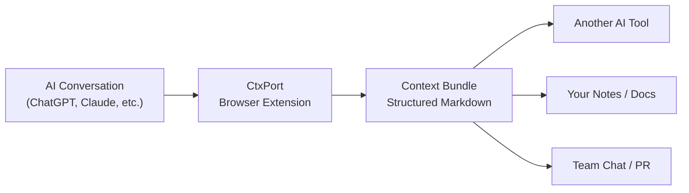

<div align="center">


# CtxPort

### **One click. Structured Markdown. Any AI conversation.**

Your AI conversations deserve a better clipboard.

[](https://github.com/nicepkg/ctxport)
[](LICENSE)
[](https://github.com/nicepkg/ctxport/pulls)
[](https://developer.chrome.com/docs/extensions/mv3/)

[简体中文](./README_cn.md) | English

**Supported Platforms**

[](https://chatgpt.com)
[](https://claude.ai)
[](https://gemini.google.com)
[](https://chat.deepseek.com)
[](https://grok.com)
[](https://github.com)

<br />

[Get Started](#-quick-start) · [Features](#-features) · [Documentation](https://ctxport.xiaominglab.com)

</div>

---

## The Problem

You just spent 45 minutes in a deep conversation with ChatGPT. You found the perfect architecture for your project. Now you need to share it with Claude for implementation.

What do you do?

**Ctrl+A, Ctrl+C?** You get a mess of HTML artifacts, broken formatting, and missing code blocks.

**Copy each message manually?** Life is too short.

**Screenshot it?** Text in images is where knowledge goes to die.

AI conversations are the new unit of knowledge work. But moving them between tools feels like faxing a PDF in 2026.

**CtxPort fixes this.** One click, and your entire conversation becomes a clean, structured Markdown document -- ready to paste into any AI tool, editor, or knowledge base.

### The Difference

|                              | Without CtxPort                                    | With CtxPort                         |
| :--------------------------- | :------------------------------------------------- | :----------------------------------- |
| **Copy a conversation**      | Select all, copy, paste, fix formatting for 10 min | One click. Done.                     |
| **Move context between AIs** | Re-type your whole conversation history            | Paste the Context Bundle, keep going |
| **Save a conversation**      | Bookmark it and pray the URL survives              | Structured Markdown you own forever  |
| **Share with your team**     | "Let me screenshot this..."                        | Share a clean `.md` file             |
| **Extract just the code**    | Scroll through 50 messages hunting for snippets    | Code Only mode, one click            |

### Key Benefits

```
  No account required           Works offline
  Zero data uploaded            100% local processing
  Minimal permissions           Open source (MIT)
```

---

## How It Works



1. **Browse** any supported platform
2. **Click** the CtxPort copy button (or press `Alt+Shift+C`)
3. **Paste** your structured Context Bundle anywhere

That's it. No configuration. No sign-up. No cloud.

---

## Features

### Copy From Anywhere

| Feature                 | Description                                                                        |
| :---------------------- | :--------------------------------------------------------------------------------- |
| **In-Chat Copy Button** | A copy button appears right in the conversation -- click to copy the entire thread |
| **Sidebar List Copy**   | Hover over any conversation in the sidebar and copy without even opening it        |
| **Keyboard Shortcut**   | `Alt+Shift+C` copies the current conversation instantly                            |
| **Multiple Formats**    | Full, User Only, Code Only, Compact -- pick what you need                          |

### Sidebar List Copy -- The Feature Nobody Else Has

Most copy tools make you open a conversation first. CtxPort lets you hover over conversations in the sidebar and copy them directly. Need to grab 5 conversations for a project brief? Hover, click, hover, click. No page loads. No waiting.

### Context Bundle Format

Every copy produces a structured Markdown document with frontmatter metadata:

```markdown
---
ctxport: v2
source: chatgpt
url: https://chatgpt.com/c/abc123
title: "Discuss REST API Authentication"
date: 2026-02-07T14:30:00Z
nodes: 24
format: full
---

## User

I'm building a SaaS product and need to choose between
API key auth and OAuth2. What do you recommend?

## Assistant

Based on your scenario, I'd recommend a layered approach...
```

The frontmatter tells any receiving tool exactly where this conversation came from, when it happened, and how many messages it contains. Structured context, not just raw text.

### Copy Formats

| Format        | What You Get                             | Best For                               |
| :------------ | :--------------------------------------- | :------------------------------------- |
| **Full**      | Complete conversation with all messages  | Context transfer between AI tools      |
| **User Only** | Only your messages (prompts)             | Reusing your prompts in a different AI |
| **Code Only** | Extracted code blocks with language tags | Grabbing implementation snippets       |
| **Compact**   | Condensed single-paragraph messages      | Quick sharing in chat or email         |

---

## Quick Start

### Install from Chrome Web Store

> Coming soon -- currently in development. Star the repo to get notified!

### Build from Source

```bash
# Clone the repo
git clone https://github.com/nicepkg/ctxport.git
cd ctxport

# Install dependencies
pnpm install

# Build all packages
pnpm build

# Start the extension in dev mode
pnpm dev:ext
```

Then load the unpacked extension from `apps/browser-extension/dist/chrome-mv3-dev` in `chrome://extensions`.

### Usage

1. Navigate to any supported platform (ChatGPT, Claude, Gemini, DeepSeek, Grok, GitHub)
2. Start or open a conversation
3. Click the **CtxPort copy button** that appears in the chat, or press `Alt+Shift+C`
4. Paste your Context Bundle wherever you need it

For sidebar list copy: hover over any conversation in the left sidebar to reveal the copy icon.

---

## Roadmap

- [x] ChatGPT support
- [x] Claude support
- [x] Gemini support
- [x] DeepSeek support
- [x] Grok support
- [x] GitHub Issues & PRs support
- [x] Sidebar list copy
- [x] Multiple copy formats
- [x] Keyboard shortcuts
- [ ] Chrome Web Store release
- [ ] Firefox support
- [ ] Context Bundle import (paste a bundle to restore conversation context)
- [ ] Batch export (select multiple conversations, export as a bundle)
- [ ] Custom format templates

---

## Architecture

```
ctxport/
  packages/
    core-schema/       # Zod schemas for Context Bundle format
    core-plugins/      # Platform adapters (ChatGPT, Claude, etc.)
    core-markdown/     # Markdown serialization engine
    shared-ui/         # Shared React components
  apps/
    browser-extension/ # WXT + React 19 + Tailwind CSS 4
```

Built as a monorepo with pnpm workspaces and Turborepo. Each platform adapter is a self-contained plugin, making it straightforward to add new platforms.

---

## Contributing

Contributions are welcome! Whether it's a bug report, feature request, or pull request -- every contribution helps.

```bash
# Fork and clone the repo
git clone https://github.com/YOUR_USERNAME/ctxport.git

# Install dependencies
pnpm install

# Start development
pnpm dev:ext
```

See [CONTRIBUTING.md](CONTRIBUTING.md) for detailed guidelines.

### Contributors

<a href="https://github.com/nicepkg/ctxport/graphs/contributors">
  
</a>

---

## License

[MIT](LICENSE) -- Use it however you want.

---

<div align="center">

**If CtxPort saves you time, consider giving it a star.**

It helps others discover the project and keeps development going.

[](https://github.com/nicepkg/ctxport)

</div>
