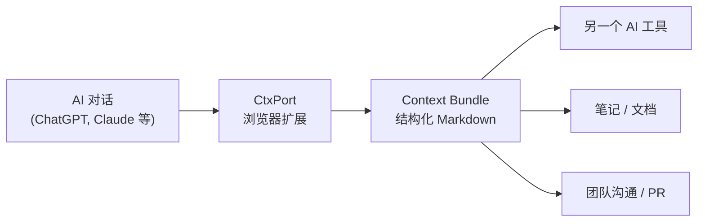

<div align="center">


# CtxPort

### **一键复制。结构化 Markdown。任何 AI 对话。**

你的 AI 对话，值得一个更好的剪贴板。

[](https://github.com/nicepkg/ctxport)
[](LICENSE)
[](https://github.com/nicepkg/ctxport/pulls)
[](https://developer.chrome.com/docs/extensions/mv3/)

简体中文 | [English](./README.md)

**支持的平台**

[](https://chatgpt.com)
[](https://claude.ai)
[](https://gemini.google.com)
[](https://chat.deepseek.com)
[](https://grok.com)
[](https://github.com)

<br />

[快速开始](#-快速开始) · [功能特性](#-功能特性) · [文档](https://ctxport.xiaominglab.com)

</div>

---

## 痛点

你刚花了 45 分钟和 ChatGPT 深度对话，找到了项目的完美架构方案。现在你需要把它交给 Claude 来实现。

怎么办？

**Ctrl+A, Ctrl+C？** 你得到的是一堆 HTML 残留、格式错乱和丢失的代码块。

**逐条手动复制？** 人生苦短。

**截图？** 文字变成图片，就是知识的坟墓。

AI 对话已经成为知识工作的新单位。但在工具之间搬运它们，就像在 2026 年用传真发 PDF。

**CtxPort 解决这个问题。** 一键点击，整段对话变成干净的结构化 Markdown 文档——随时粘贴到任何 AI 工具、编辑器或知识库。

### 对比

|                        | 没有 CtxPort                       | 有 CtxPort                    |
| :--------------------- | :--------------------------------- | :---------------------------- |
| **复制对话**           | 全选、复制、粘贴、花 10 分钟修格式 | 一键搞定                      |
| **在 AI 间迁移上下文** | 重新输入整段对话历史               | 粘贴 Context Bundle，继续对话 |
| **保存对话**           | 收藏链接，祈祷 URL 别失效          | 结构化 Markdown，永远属于你   |
| **分享给团队**         | "我截个图给你看..."                | 分享一个干净的 `.md` 文件     |
| **只提取代码**         | 在 50 条消息里翻来翻去找代码片段   | Code Only 模式，一键提取      |

### 核心优势

```
  无需注册账号              离线可用
  零数据上传               100% 本地处理
  最小权限                 开源 (MIT)
```

---

## 工作原理



1. **浏览** 任何支持的平台
2. **点击** CtxPort 复制按钮（或按 `Alt+Shift+C`）
3. **粘贴** 结构化 Context Bundle 到任何地方

就这么简单。无需配置。无需注册。无需云端。

---

## 功能特性

### 随处复制

| 功能               | 描述                                             |
| :----------------- | :----------------------------------------------- |
| **对话内复制按钮** | 复制按钮直接出现在对话中——点击即可复制整段对话   |
| **侧边栏列表复制** | 悬停在侧边栏的任意对话上，不用打开就能直接复制   |
| **键盘快捷键**     | `Alt+Shift+C` 一键复制当前对话                   |
| **多种格式**       | 完整对话、仅用户消息、仅代码、紧凑模式——按需选择 |

### 侧边栏列表复制——别人没有的功能

大多数复制工具要求你先打开对话。CtxPort 让你直接在侧边栏悬停复制，不需要打开。需要为项目简报收集 5 段对话？悬停、点击、悬停、点击。不用加载页面。不用等待。

### Context Bundle 格式

每次复制都会生成一份带有 frontmatter 元数据的结构化 Markdown 文档：

```markdown
---
ctxport: v2
source: chatgpt
url: https://chatgpt.com/c/abc123
title: "讨论 REST API 认证方案"
date: 2026-02-07T14:30:00Z
nodes: 24
format: full
---

## User

我正在做一个 SaaS 产品，需要在 API Key 认证
和 OAuth2 之间做选择。你有什么建议？

## Assistant

根据你的场景，我建议采用分层方案...
```

frontmatter 告诉接收工具这段对话来自哪里、什么时候发生的、包含多少条消息。结构化的上下文，而不仅仅是原始文本。

### 复制格式

| 格式                    | 内容                       | 适用场景                    |
| :---------------------- | :------------------------- | :-------------------------- |
| **Full（完整）**        | 包含所有消息的完整对话     | AI 工具间的上下文迁移       |
| **User Only（仅用户）** | 只包含你的消息（提示词）   | 在不同 AI 中复用你的 prompt |
| **Code Only（仅代码）** | 提取的代码块，保留语言标签 | 快速获取代码片段            |
| **Compact（紧凑）**     | 压缩为单段的消息           | 在聊天或邮件中快速分享      |

---

## 快速开始

### 从 Chrome Web Store 安装

> 即将上线——目前开发中。Star 本仓库以获取通知！

### 从源码构建

```bash
# 克隆仓库
git clone https://github.com/nicepkg/ctxport.git
cd ctxport

# 安装依赖
pnpm install

# 构建所有包
pnpm build

# 以开发模式启动扩展
pnpm dev:ext
```

然后在 `chrome://extensions` 中加载 `apps/browser-extension/dist/chrome-mv3-dev` 目录作为未打包扩展。

### 使用方法

1. 打开任何支持的平台（ChatGPT, Claude, Gemini, DeepSeek, Grok, GitHub）
2. 开始或打开一段对话
3. 点击对话中出现的 **CtxPort 复制按钮**，或按 `Alt+Shift+C`
4. 将 Context Bundle 粘贴到任何你需要的地方

侧边栏列表复制：悬停在左侧边栏的任意对话上，即可看到复制图标。

---

## 路线图

- [x] ChatGPT 支持
- [x] Claude 支持
- [x] Gemini 支持
- [x] DeepSeek 支持
- [x] Grok 支持
- [x] GitHub Issues & PRs 支持
- [x] 侧边栏列表复制
- [x] 多种复制格式
- [x] 键盘快捷键
- [ ] Chrome Web Store 上架
- [ ] Firefox 支持
- [ ] Context Bundle 导入（粘贴 bundle 恢复对话上下文）
- [ ] 批量导出（选择多段对话，合并导出为一个 bundle）
- [ ] 自定义格式模板

---

## 架构

```
ctxport/
  packages/
    core-schema/       # Zod schema，Context Bundle 格式定义
    core-plugins/      # 平台适配器（ChatGPT, Claude 等）
    core-markdown/     # Markdown 序列化引擎
    shared-ui/         # 共享 React 组件
  apps/
    browser-extension/ # WXT + React 19 + Tailwind CSS 4
```

使用 pnpm workspaces + Turborepo 构建的 monorepo。每个平台适配器是独立的插件，方便添加新平台支持。

---

## 参与贡献

欢迎贡献！无论是 Bug 报告、功能建议还是 Pull Request——每一份贡献都有价值。

```bash
# Fork 并克隆仓库
git clone https://github.com/YOUR_USERNAME/ctxport.git

# 安装依赖
pnpm install

# 启动开发
pnpm dev:ext
```

详细指南请查看 [CONTRIBUTING.md](CONTRIBUTING.md)。

### 贡献者

<a href="https://github.com/nicepkg/ctxport/graphs/contributors">
  
</a>

---

## 许可证

[MIT](LICENSE) -- 随便用。

---

<div align="center">

**如果 CtxPort 帮你节省了时间，请考虑给它一个 Star。**

这能帮助更多人发现这个项目，也是对开发的最大支持。

[](https://github.com/nicepkg/ctxport)

</div>
